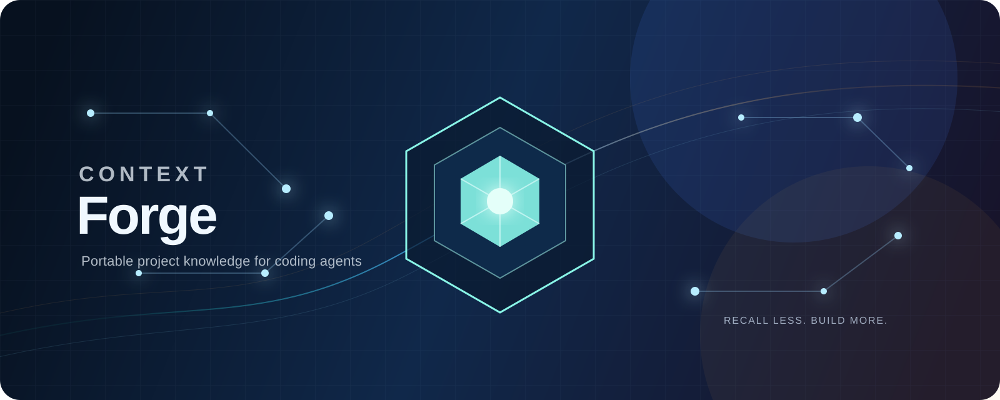

# Context Forge

  

  <strong>Durable, reviewable project memory for Claude Code and Codex.</strong> 
  Keep the important context. Load only what the task needs.

  
  
  
  
  

Context Forge gives a codebase a small, useful memory that survives across agent sessions. It works with both Claude Code and Codex from one lightweight, dependency-free engine.

It solves two common problems:

- Every new chat starts by rediscovering the project.
- A memory system slowly fills the context window with stale notes.

Context Forge keeps a short hot brief for every session, a larger knowledge store for on-demand lookup, and a human approval gate before anything becomes permanent.

## Quick start

### One-go agent prompt

Copy this into Claude Code or Codex while you are in the project you want to set up.

~~~text
Install Context Forge from https://github.com/manojvermamv/context-forge into this current repository. Use project scope, preserve all existing Claude Code and Codex settings, initialize this repository’s .brain folder, and show me every hook that I need to review and trust. Do not approve or write proposed memory automatically.
~~~

### One command from GitHub

From the root of the project you want Context Forge to remember:

~~~bash
git clone https://github.com/manojvermamv/context-forge.git /tmp/context-forge && python3 /tmp/context-forge/install.py --harness all --scope project --repo "$PWD" && python3 /tmp/context-forge/scripts/brain.py init "$PWD"
~~~

This installs hooks only in the current project, copies the engine to **~/.context-forge**, and creates **.brain/** in the project.

For Windows PowerShell:

~~~powershell
git clone https://github.com/manojvermamv/context-forge.git "$env:TEMP\context-forge"
if ($LASTEXITCODE -eq 0) { python "$env:TEMP\context-forge\install.py" --harness all --scope project --repo (Get-Location); python "$env:TEMP\context-forge\scripts\brain.py" init (Get-Location) }
~~~

After installing for Codex, run **/hooks** once and review each new or changed hook. Codex will not run untrusted hooks.

## How it works

~~~mermaid
flowchart LR
  A[Start or resume a session] --> B[Load hot brief current state + routes]
  B --> C[Work normally]
  C --> D{Need more context?}
  D -->|Yes| E[Search the on-demand store]
  E --> C
  D -->|No| F[Finish, compact, or hand off]
  F --> G[Stage a proposed memory update]
  G --> H{Human review}
  H -->|Approve| I[Update durable memory]
  H -->|Reject or revise| J[Keep it out of memory]
  I --> B
~~~

The idea is simple:

1. **Start small.** Hooks load a bounded **current-state.md** file and a short routing list.
2. **Look up details only when needed.** Decisions, concepts, the code map, and history stay on disk until the task calls for them.
3. **Capture carefully.** Session hooks create a private proposed update, never a direct permanent edit.
4. **Make lasting knowledge intentional.** You inspect and explicitly approve one candidate before Context Forge changes shared memory.

This progressive-disclosure approach keeps routine context overhead low. It uses local, deterministic work in hooks instead of a model or MCP call for every lifecycle event; the design target is to stay near or below the research benchmark of about **$0.05 per hook heartbeat**, versus about **$0.38 for an equivalent MCP-tool-call flow**. Your actual cost depends on your model, provider, and project.

## What Context Forge remembers

~~~text
.brain/
├── current-state.md       Small hot brief injected at session start
├── index.md               Short map of where to find deeper knowledge
├── map.md                 Generated codebase map
├── overview.md            Project orientation for people and agents
├── log.md                 Approved history only
├── decisions/             Durable technical decisions
├── concepts/              On-demand subsystem knowledge
└── .state/                Private candidates, search data, and reports
~~~

**.state/** is private working state. It is ignored by Git and is never treated as project memory.

## Safety by design

Self-evolving does **not** mean it writes whatever it wants.

~~~text
hook event → private candidate → your review → named approval → durable memory
~~~

Hooks can collect a concise candidate at session stop, compaction, subagent stop, or session end. They screen for secrets and write only to **.brain/.state/pending/**. Nothing reaches **current-state.md** or **log.md** until you approve a specific candidate.

~~~bash
# See proposed updates
python3 ~/.context-forge/scripts/brain.py review /path/to/project --pending

# Approve one candidate you have reviewed
python3 ~/.context-forge/scripts/brain.py review /path/to/project --approve <candidate-id>
~~~

The guard hook also blocks direct tool edits to Context Forge’s generated and hot-memory files. It understands Claude Code and Codex apply_patch payloads, including Codex Windows path shapes. Hooks are useful guardrails, not a replacement for normal repository permissions and review.

## Everyday use

Once a project is initialized, continue working normally. Context Forge silently adds relevant pointers when it is confident they help. It stays quiet when it cannot find a useful match.

Use these commands when you want to work with memory directly:

~~~bash
# Refresh the generated code map and routing index
python3 ~/.context-forge/scripts/brain.py map /path/to/project
python3 ~/.context-forge/scripts/brain.py index /path/to/project

# Search deeper memory without loading it all
python3 ~/.context-forge/scripts/brain.py search /path/to/project "authentication"

# Check memory health and see the hot-vs-full-memory reduction
python3 ~/.context-forge/scripts/brain.py doctor /path/to/project

# Check for broken or oversized memory
python3 ~/.context-forge/scripts/brain.py lint /path/to/project
~~~

For an important decision or a new technical concept, start with **templates/decision.md** or **templates/concept.md**, then run **index**. Do not put secrets, credentials, raw source dumps, or guesses into project memory.

## Claude Code and Codex

The installer merges its hooks with existing settings; it does not replace unrelated configuration.

| Lifecycle moment | Context Forge action |
|---|---|
| Session starts or resumes after compaction | Load the short hot brief and routes |
| A new user prompt arrives | Offer up to three relevant pointers, or stay silent |
| A tool tries to edit managed memory | Guard the protected paths |
| Stop, compaction, subagent stop, or session end | Stage a proposed update for review |

The same hook lifecycle is wired for both platforms. Codex users must approve hook trust through **/hooks**; Claude Code users should review their project or global hook settings as they normally would.

## Install choices

The quick start uses **project scope**, which is best when you want a team to commit the hook configuration with the repository.

~~~bash
# Make Context Forge available to every project for your local user
python3 install.py --harness all --scope global

# Configure only one repository; preserve its existing settings
python3 install.py --harness all --scope project --repo /path/to/project
~~~

Use **--harness claude** or **--harness codex** if you use only one agent. You can also pass **--engine-dir /your/path** when the default **~/.context-forge** location is not suitable.

## Verify the installation

~~~bash
python3 ~/.context-forge/scripts/brain.py status /path/to/project
python3 ~/.context-forge/scripts/brain.py doctor /path/to/project
~~~

Doctor reports the full-memory baseline, the actual cold-start payload, an estimated token count, and the progressive-disclosure reduction. The project’s tests also cover the full staged-review path, compaction reload, persistent memory, hook guard behavior, Codex patch-path handling, and fallback search:

~~~bash
python tests/smoke_test.py
bash tests/smoke_test.sh
~~~

## References

Context Forge combines durable project documentation with the ergonomics of lifecycle hooks:

- **Small by default:** only the hot brief is loaded automatically.
- **Useful when needed:** search routes to a decision, concept, map section, or approved history entry.
- **Safe to share:** permanent memory changes are staged, inspected, and explicitly approved.
- **Portable:** one Python standard-library engine, no embeddings service, daemon, or database dependency.

Context Forge is informed by the following work:

- [Karpathy’s LLM Wiki note](https://gist.githubusercontent.com/karpathy/442a6bf555914893e9891c11519de94f/raw/ac46de1ad27f92b28ac95459c782c07f6b8c964a/llm-wiki.md) — durable repository knowledge for coding agents.
- [llmwiki](https://github.com/suwonleee/llmwiki) — current thinking on agent-readable project context.
- [Project Wiki](https://github.com/giodra96/project-wiki) — index-first progressive disclosure and the public README presentation that inspired this project’s documentation style.

## Author

Created by [Manoj Verma](https://github.com/manojvermamv).

## License

MIT.
